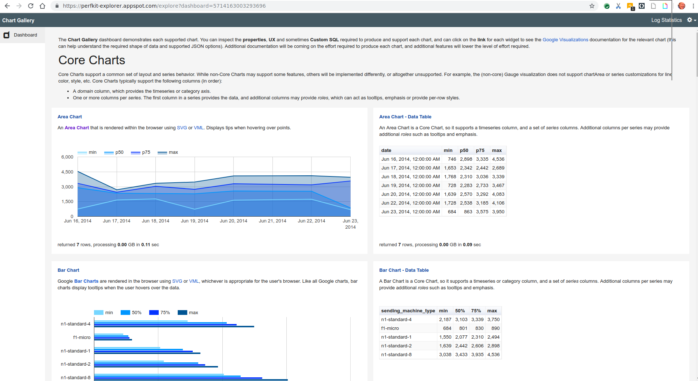
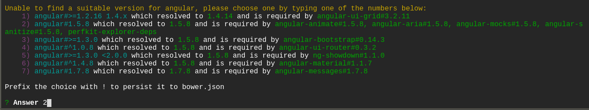
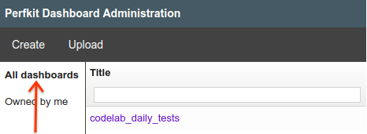
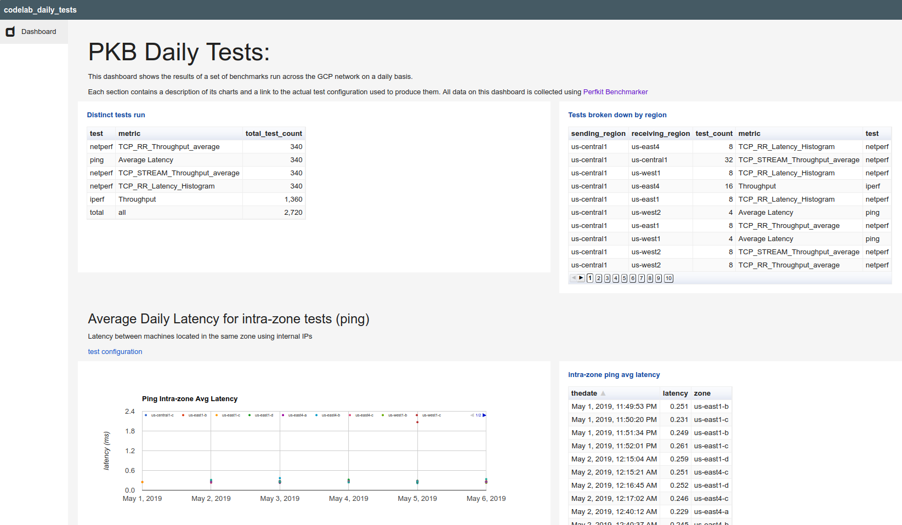
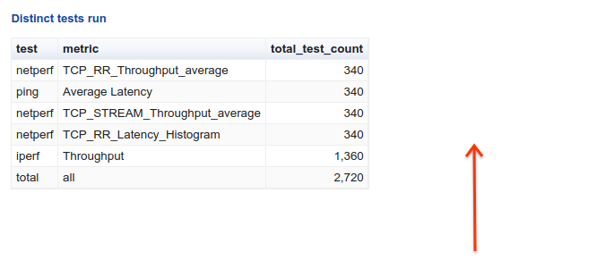

# PerfKitBenchmarker Code Lab

## Overview

### Performance benchmarking

For most users, performance benchmarking is a series of steps in pursuit of an
answer to a performance question.


### Performance benchmarking on public cloud

Conducting performance benchmarking in public cloud adds layers to the
challenge. Experiments need to provision resources, manage security
issues by introducing firewall rules, and eventually deprovision resources.

PerfKit Benchmarker and PerfKit Explorer were created to aid benchmark
selection, execution, and analysis using public cloud resources.

### Introducing PerfKit Benchmarker

PerfKit Benchmarker (PKB) is an open source framework that provides a wide
selection of benchmarking tools that you can use to measure and compare
cloud providers. PKB automates setup and teardown of resources, including
Virtual Machines (VMs), on whichever cloud provider you choose, along with
installing and running the actual benchmark tests.

#### PKB Architecture

PKB divides benchmarking experiments into a multi-step process:

1.  Configuration
1.  Provisioning
1.  Execution
1.  Teardown
1.  Publish


## What you'll do

In this lab, you will:

*   Install PerfKit Benchmarker
*   Explore PKB command-line flags
*   Consider different network benchmarks
*   Run benchmark tests using PerfKit Benchmarker
*   Inspect and using custom configuration files for tests
*   Persist test result data to BigQuery
*   Query and visualize result data with PerfKit Explorer

## Prerequisites

*   Basic familiarity with Linux command line

## Setup

### What you'll need

To complete this lab, you'll need:

*   Access to a standard internet browser (Chrome browser recommended),
    where you can access the GCP Console and the GCP Cloud Shell
*   A GCP project

### Sign in to GCP Console

In your browser, open the [GCP Console](https://console.cloud.google.com).

### Activate the Cloud Shell

From the GCP Console click the Cloud Shell icon on the top right toolbar:


Then click "Start Cloud Shell".

It should only take a few moments to provision and connect to the environment.

This virtual machine is loaded with all the development tools you'll need.
It offers a persistent 5GB home directory, and runs on the Google Cloud,
greatly enhancing network performance and authentication. Much, if not all,
of your work in this lab can be done with simply a browser or your
Google Chromebook.

Once connected to the Cloud Shell, you should see that you are already
authenticated and that the project is already set to your PROJECT_ID.

Run the following command in the Cloud Shell to confirm that you are
authenticated:

```
gcloud auth list
```

**Expected output**

```
Credentialed accounts:
 - <myaccount>@<mydomain>.com (active)
```

**Note:** `gcloud` is the powerful and unified command-line tool for
Google Cloud Platform. Full documentation is available
from https://cloud.google.com/sdk/gcloud. It comes pre-installed on
Cloud Shell. You will notice its support for tab-completion.

In Cloud Shell, Verify your project is set up as expected.

```
gcloud config list project
```

**Expected output**

```
[core]
project = <PROJECT_ID>
```

If it is not, you can set it with this command:

```
gcloud config set project <PROJECT_ID>
```

**Expected output**

```
Updated property [core/project].
```

## Installing PKB using git

**Note**: in this lab, you use the
[SMU AT&T Center for Virtualization](https://www.smu.edu/Provost/virtualization)
fork of the base
[PKB repo](https://github.com/GoogleCloudPlatform/PerfKitBenchmarker). This
[fork](https://github.com/SMU-ATT-Center-for-Virtualization/PerfKitBenchmarker.git)
has a few extra features which will be merged back to the main repo soon.

#### Step 1

In Cloud Shell, `clone` the PerfKitBenchmarker repository.

```
cd ~
```

```
git clone https://github.com/SMU-ATT-Center-for-Virtualization/PerfKitBenchmarker.git
```

#### Step 2

Change to the PerfKitBenchmarker directory.

```
cd ~/PerfKitBenchmarker
```

#### Step 3

Install dependencies of PKB

```
sudo pip install -r requirements.txt
```

**Note**: As part of this exercise, you will will run a few basic tests on GCP
within a simple PKB environment. Additional setup may be required to run
benchmarks on other providers, or to run more complex benchmarks. Comprehensive
instructions for running other benchmarks can be located by reviewing the
[README in the PKB repo](https://github.com/GoogleCloudPlatform/PerfKitBenchmarker).

## Running PKB using command-line flags

You can run benchmarks right now. If you execute `./pkb.py`, with no
command-line flags, PKB will attempt to run a standard set of benchmarks
on default machine types in the default region. You can read more about the
**standard_set** later in this lab.

Instead, it is more common to choose specific benchmarks and options
using **command-line flags**.

### The project, cloud provider, zones, and machine_type flags

You should understand how the `--cloud` provider, `--project`,  `--zones`,
and `--machine_type` flags work.

*   `--cloud`: As **GCP** is the default cloud provider for PKB, the
    `--cloud` flag has a default value of **GCP**.
*   `--project`: PKB needs to have a GCP **PROJECT-ID** to run. By using Cloud
    Shell in this lab, PKB can infer the `--project` **PROJECT-ID** from
    the environment.
*   `--zone`: Every cloud provider has a default zone. For GCP, the
    `--zone` flag defaults to
    [**us-central1-a**](https://github.com/GoogleCloudPlatform/PerfKitBenchmarker/blob/master/perfkitbenchmarker/configs/default_config_constants.yaml).
*   `--machine_type`: Benchmarks are frequently tightly coupled to
    specific machine capabilities, especially CPU and memory. You can pick
    your specific machines with the `--machine_type` flag. Most benchmark
    tests, including the common networking benchmarks **ping**, **iperf**,
    and **netperf**, default to the provider-specific
    `default_single_core` machine. On GCP, the default machine is the [**n1-standard-1**](https://github.com/GoogleCloudPlatform/PerfKitBenchmarker/blob/master/perfkitbenchmarker/configs/default_config_constants.yaml.)

You can learn more about alternative flag values in the
[Useful Global Flags](https://github.com/GoogleCloudPlatform/PerfKitBenchmarker#useful-global-flags)
section of the PKB readme.

### Run one benchmark test with the benchmarks flag

The `--benchmarks` flag is used to select the benchmark(s) run. Not supplying
`--benchmarks` is the same as using `--benchmarks="standard_set"`.
The **standard_set** is a collection of commonly used benchmarks. You can read
more about benchmark sets later in this lab.

Cloud benchmark tests commonly need at least 10minutes to complete because of
the many resources, including networks, firewall rules, and VMs, that must
be both provisioned and de-provisioned.

**Start a benchmark test now, and then continue working through the lab while
the test executes.**

Run the commonly used network throughput test, **iperf**, with a small
machine, **n1-standard-1**.

**Expected duration**: ~13-14min.

```
./pkb.py --benchmarks=iperf
```

**Expected output**:

```
-------------------------PerfKitBenchmarker Results Summary-------------------------
IPERF:
  receiving_machine_type="n1-standard-1" receiving_zone="us-central1-a" run_number="0" runtime_in_seconds="60" sending_machine_type="n1-standard-1" sending_thread_count="1" sending_zone="us-central1-a"
  Throughput                         1966.000000 Mbits/sec                      (ip_type="external")
  Throughput                         1968.000000 Mbits/sec                      (ip_type="internal")
  Throughput                         1962.000000 Mbits/sec                      (ip_type="external")
  Throughput                         1968.000000 Mbits/sec                      (ip_type="internal")
  End to End Runtime                  787.150529 seconds
...
------------------------------------------
Name   UID     Status     Failed Substatus
------------------------------------------
iperf  iperf0  SUCCEEDED
------------------------------------------
Success rate: 100.00% (1/1)
```

## Discovering helfpul flags and notes about benchmark tests

While **iperf** is running, explore PKB benchmarks and flags.

#### Step 1

Open a second Cloud Shell in GCP Console by clicking the **Add Cloud Shell
Session** button on top of the existing Cloud Shell.

#### Step 2

Change to the PerfKitBenchmarker directory.

```
cd ~/PerfKitBenchmarker
```

#### Step 3

PKB includes the `--helpmatch` flag which can be used to discover details
about benchmarks and related configuration flags. You can pass
`--helpmatch` a regex and it will print related help text.

Review all the global flags for PKB.

```
./pkb.py --helpmatch=pkb
```

#### Step 4

As used already, the `--benchmarks` selects a specific benchmark or
benchmark set.

Review the full list of benchmarks available.

```
./pkb.py --helpmatch=benchmarks | grep perfkitbenchmarker
```

You should see around 70 different benchmarks available to run, within the
linux_benchmarks collection.

PKB has a naming convention for benchmarks of
**[COLLECTION]_benchmarks.[NAME]_benchmark**. For example:
*   linux_benchmarks.ping_benchmark
*   linux_benchmarks.iperf_benchmark
*   linux_benchmarks.netperf_benchmark

#### Step 5

When you want to review the details and flags of a benchmark in depth, it can be
easier to read formatted MarkDown.

One advantage of our **fork** of PKB is a new `--helpmatchmd` flag. The
`--helpmatchmd` flag emits more easily readable MarkDown text than
`--helpmatch`.

The MarkDown from using `--helpmatchmd` has also been checked back into our
fork in the [testsuite_docs folder](https://github.com/SMU-ATT-Center-for-Virtualization/PerfKitBenchmarker/tree/master/testsuite_docs).

Review the available Linux benchmarks from the
[linux_benchmarks file](https://github.com/SMU-ATT-Center-for-Virtualization/PerfKitBenchmarker/blob/master/testsuite_docs/linux_benchmarks.md).

Try searching on **ping_benchmark**, **iperf_benchmark**, and
**netperf_benchmark**.

#### Step 6

Each benchmark can have custom flags too. Review the flags for the
**netperf** and **iperf** benchmarks.

```
./pkb.py --helpmatchmd=netperf
```

```
./pkb.py --helpmatchmd=iperf
```

You can see multiple flags to customize these benchmark runs.

## Considering Different Network Test Tools

PerfKitBenchmarker includes 3 widely used **networking** benchmarks:
**ping**, **iperf**, and **netperf**. Each of these network tests can be useful
in different situations.

### ping

The **ping** command is the most widely distributed and is commonly used to
verify connectivity and measure simple network latency. It measures the
round trip time (rtt) of ICMP packets.

### iperf

The **iperf** tool is easy to use and is used to measure network throughput
using TCP or UDP streams. It supports multiple threads streaming data
simultaneously. It has a variety of parameters that can be set to test and
maximize throughput.

**Note**: as of 2019, **iperf** is the name of the benchmark, but
**iperf v2** is used.

### netperf

The **netperf** tool contains several different test types. You can use
**TCP_RR**, TCP request-response, to test network latency. You can run
**TCP_STREAM** to test network throughput.

You can run multiple instances of netperf in parallel to heavily stress links
via multiple processors. The netperf tool also supports running UDP latency
and throughput tests.

With netperf, you can also see alternative reporting flavors with its data
histograms.

In many cases, it is recommended to run combinations of all three networking
benchmark tools and use the additional test result data to confirm your
findings.

## Exploring the results of a benchmark

The **iperf** test you started, should now be completed. Return to the first
Cloud Shell to review the test results from **iperf**.

Detailed output from benchmark execution is printed to the terminal, and saved
to log files under `/tmp/perfkitbenchmarker/runs/`.

Whether you scroll back in the Cloud Shell, or look through the `pkb.log` file,
you can review many details about the benchmark pass:

*   **PKB details**:* version# and flags used.
*   **Resources being provisioned**: an auto-mode VPC network, two firewall rules,
    one for internal IPs and another for external IPs, two VM instances, and
    attached persistent-disks.
*   **Software setup**: Setup directories on both VMs, installations of python,
    iperf, and other packages.
*   **System configuration**: adjustments to kernel settings,
    including `tcp_congestion_control`.
*   **Test execution**: this **iperf** benchmark runs 4 different tests...
    *   VM1->VM2 throughput test over external IPs
    *   VM1->VM2 throughput test over internal IPs
    *   VM2->VM1 throughput test over external IPs
    *   VM2->VM1 throughput test over internal IPs
*   **Resources being cleaned up**: deprovision the resources created earlier.
*   **Detailed result data**:
    *   Detailed metadata describing the resources allocated.
    *   Metrics: including timestamp, units, and values for measurements.
*   **Results Summary**: an easy-to-read table with the key metrics and values.
*   **Overall test status**: especially useful when multiple benchmarks have run.

## Running more Network Benchmarks

When you have time, later, run a few more networking benchmarks. Explore the
log output, and results summaries carefully. Consider adjusting flags for the
benchmarks by looking through the `--helpmatchmd` output.

### Measure latency with ping

Run a test to determine the latency between two machines in a single
zone. Supply the machine_type and/or zone.

**Expected duration**: ~11-12min. each

```
./pkb.py --benchmarks=ping --machine_type=f1-micro
```

```
./pkb.py --benchmarks=ping --zones=us-east1-b
```

### Measure latency and throughput with netperf

Run a test to determine the throughput and latency between two machines in a
single zone.

**Note**: as of 2019, **netperf** is the name of the benchmark, but
**netperf v2.7.0** is used with some PKB-specific patches.

**Expected duration**: ~20min.

The **netperf** benchmark takes a little longer than **iperf* *because the
binaries are compiled on the VMs, and the VMs are rebooted to apply
kernel/system configuration changes.

```
./pkb.py --benchmarks=netperf
```

## Creating Config Files for More Complex Tests

The easiest way To run networking benchmarks between two specific zones with
specific flags is to use **benchmark configuration files**. For example, the
following configuration file runs **iperf** between a VM in zone
`us-central1-b` and a VM in zone `us-east1-b`, with 5 sending threads, with
2 vCPU machines, for 30 seconds each.

You can set the cloud provider, zone, machine type, and many other options for
each VM in the config file.

**sample_config.yml**

```
iperf:
  vm_groups:
    vm_1:
      cloud: GCP
      vm_spec:
        GCP:
          machine_type: n1-standard-2
          zone: us-central1-b
    vm_2:
      cloud: GCP
      vm_spec:
        GCP:
          machine_type: n1-standard-2
          zone: us-east1-b
flags:
  iperf_sending_thread_count: 5
  iperf_runtime_in_seconds: 30
```

When you have time later, run this benchmark using the config file.

**Expected duration**: 13-14min.

```
./pkb.py --benchmark_config_file=sample_config.yml --benchmarks=iperf
```

**Note**: even though the config file includes the benchmark name, you must
still supply the `--benchmarks` flag.

**Expected output**:

```
-------------------------PerfKitBenchmarker Results Summary-------------------------
IPERF:
...
----------------------------------------
Name  UID    Status     Failed Substatus
----------------------------------------
iperf  iperf0  SUCCEEDED
----------------------------------------
Success rate: 100.00% (1/1)
...
```

By default, config files must reside under the
`PerfKitBenchmarker/perfkitbenchmarker/configs/` directory. Our fork has a
`sample_config.yml` file in the configs directory.

You can also specify the full path of the config file:

```
./pkb.py --benchmark_config_file=/path/to/config/file.yml --benchmarks=iperf
```

## Understanding Benchmark Sets

PKB defines curated collections of benchmark tests called **benchmark sets**.
These sets are defined in the `perfkitbenchmarker/benchmark_sets.py`
[file](https://github.com/GoogleCloudPlatform/PerfKitBenchmarker/blob/master/perfkitbenchmarker/benchmark_sets.py).

Sets include:
*   **standard_set**: commonly agreed upon set of cloud performance benchmarks.
*   **google_set**: slightly longer collection of benchmarks than
    standard_set. Includes `tensorflow` benchmarks.
*   **kubernetes_set**: collection of tests intended to run on Kubernetes
    clusters. Requires specialized setup at this time.
*   **cloudsuite_set**: collection of cloudsuite_XXX benchmarks.

Other sets are defined as well.

You can also run multiple benchmarks by using a comma separated list with
the `--benchmarks` flag.

## Reviewing Performance Data with BigQuery

By default PKB will output results to the terminal and save logs to the
directory `/tmp/perfkitbenchmarker/runs/`.

A recommended practice is to push your result data to
[BigQuery](https://cloud.google.com/bigquery/), a serverless,
highly-scalable, cost-effective data warehouse. You can then use BigQuery to
review your test results over time, and create data visualizations.

### Populate BigQuery dataset with sample data

To quickly experiment with BigQuery, load sample test data from the
PerfKit Explorer (PKE) repo. PKE is explained in more detail later in this lab.

#### Step 1

Open a fresh Cloud Shell in GCP Console by clicking the **Add Cloud Shell
Session** button on top of the existing Cloud Shell.

#### Step 2

Clone the PKE git repository.

```
cd ~
```

```
git clone https://github.com/SMU-ATT-Center-for-Virtualization/PerfKitExplorer.git
```

```
cd ~/PerfKitExplorer
```

#### Step 3

Initialize an empty **dataset** where result tables and views can
be created, secured and shared. 

For this lab, use the BigQuery command-line tool `bq` in Cloud Shell.

You can also create datasets using the BigQuery UI in the GCP Console.

Create a dataset for samples.

```
bq mk samples_mart
```

**Expected output**

```
Dataset '[PROJECT-ID]:samples_mart' successfully created.
```

**Note**: For this lab, use the BigQuery command-line tool `bq` in Cloud Shell.

#### Step 4

Load the `samples_mart` dataset from a file.

```
bq load --project_id=[PROJECT-ID] \
    --source_format=NEWLINE_DELIMITED_JSON \
    samples_mart.results \
    ./data/samples_mart/sample_results.json \
    ./data/samples_mart/results_table_schema.json
```

**Expected output**

```
Upload complete.
Waiting on bqjob_xxxx ... (1s) Current status: DONE
```

### Query sample data in BigQuery

You can see your data using the command-line `bq` tool, again, in Cloud Shell.

```
bq query 'SELECT * FROM samples_mart.results LIMIT 200'
```

You can also see your data using the
[BigQuery UI](https://console.cloud.google.com/bigquery).

Use the **Query View** to run a simple query that shows your results.

```
SELECT * FROM samples_mart.results LIMIT 200;
```

## Pushing Data to BigQuery with PKB

When you are ready to run benchmark sets, and push your results
to BigQuery, you need to use special command-line flags.

### Create a dataset

Initialize an empty dataset where result tables and views can be created,
secured and shared.

Use the BigQuery command-line tool `bq` in Cloud Shell.

```
bq mk example_dataset
```

**Expected output**

```
Dataset '[PROJECT-ID]:example_dataset' successfully created.
```

### Run PKB with BigQuery arguments

Run PKB experiments and push the results to BigQuery.

When you run PKB, supply the BigQuery-specific arguments to send your
result data directly to BigQuery tables.

*   `--bq_project`: your GCP **PROJECT-ID** that owns the dataset and tables.
*   `--bigquery_table`: a fully qualified table name, including the dataset. The
    first time you run experiments, PKB will create the table if it does not
    yet exist.

**Expected duration**: 13-14min.

```
./pkb.py --benchmarks=iperf \
    --bq_project=[PROJECT-ID] \
    --bigquery_table=example_dataset.network_tests
```

You can now query `example_dataset` for result data. You will learn to visualize
this data, in the next section.


## Visualizing Data with PerfKit Explorer

To really impact your business, though, you want to identify insights from your
performance projects. You need to look through many passes of multiple tests
over time. You may want to notice unexpected spikes, variations
over time, or differences from one geography to another.

Visualization tools help you to summarize large sets of result data into
understandable charts, and tables.

**PerfKit Explorer (PKE)** is an open-source companion tool for PerfKit
Benchmarker. PKE is a service and web frontend for composing queries and
dashboards.

With PKE, you can preload dashboards, queries, and views of your data
to help you identify critical insights in your performance data. PKE allows
you to describe dashboards and queries in files that can be part of your
change control processes.

PKE operates as an App Engine application in your project.

**Note**: this procedure generates an **default** App Engine application,
also called a **default** service. If you already have a **default**
application, this procedure will replace it as a new version of the default
service. Consider a new, empty project if this is a problem.

### Review a running demo instance of PKE

You can look through the supported performance chart-types on the
[live deployment demo dashboard](https://perfkit-explorer.appspot.com/explore?dashboard=5714163003293696).



### Install PKE and related packages

Build the PKE application, in Cloud Shell, from the `PerfKitExplorer`
directory.

#### Step 1

Ensure you run from the `PerfKitExplorer` directory

```
cd ~/PerfKitExplorer
```

#### Step 2

In Cloud Shell, install the prerequisite packages:

```
sudo apt-get update
```

```
sudo apt-get -y install python2.7 openjdk-8-jdk git nodejs nodejs-legacy npm
```

#### Step 3

Use git to download required submodules including closure-library.

```
git submodule update --init
```

#### Step 4

Install required packages

```
npm install
```

```
sudo npm install -g bower
```

```
bower install
```

During the bower installation process, you may be asked to select a suitable
version of angular. We want to select one of the options that resolves
to angular version 1.5.8. In the example below, we chose option 2.



### Compile and deploy the dashboard as an App Engine application

#### Step 1

Compile the application.

```
bash compile.sh
```

#### Step 2

Deploy the application to App Engine from the newly created `deploy` directory.

```
cd deploy
```

```
gcloud app deploy
```

**Expected output**

```
target url:      [https://[PROJECT-ID].appspot.com]


Do you want to continue (Y/n)?  y

Beginning deployment of service [default]...
File upload done.
Updating service [default]...done.
Setting traffic split for service [default]...done.
Deployed service [default] to [https://[PROJECT-ID].appspot.com]
```

Choose the nearest region to deploy the application.

The app will deploy to https://[PROJECT-ID].appspot.com

You now have a live PKE application running, listening on port 80.

### Load a larger set of sample data to visualize

To demonstrate the capabilities of PKE, load a larger collection of demo data
and a dashboard configuration.

#### Step 1

If you did not already do this earlier, initialize an empty dataset 
where result tables and views can be created, secured and shared.

Use the BigQuery command-line tool `bq` in Cloud Shell.

```
bq mk example_dataset
```

**Expected output**

```
Dataset '[PROJECT-ID]:example_dataset' successfully created.
```

#### Step 2

Ensure you run from the `PerfKitExplorer` directory

```
cd ~/PerfKitExplorer
```

#### Step 3

Load data to the `example_dataset` dataset from a file. The --autodetect flag
is used to autodetect the table schema. The table does not need to exist before
running the command.

```
bq load --project_id=[PROJECT-ID] \
    --autodetect \
    --source_format=NEWLINE_DELIMITED_JSON \
    example_dataset.results \
    ./data/codelab/bq_pkb_sample.json
```

**Expected output**

```
Upload complete.
Waiting on bqjob_xxxx ... (1s) Current status: DONE
```

### Prepare a dashboard configuration file

The sample dashboard configuration is stored in a json file. Edit and download
it to your local machine.

#### Step 1

First, replace all references to the BigQuery dataset and tables.

```
sed -i 's/my_project.my_dataset.my_table/[PROJECT-ID].example_dataset.results/g' \
    ./data/codelab/codelab_perfkit_dashboard.json
```

#### Step 2

Download the file from the Cloud Shell to your local machine.

From Cloud Shell click the

then **Download file**.

Name the file:

```
/home/[USERNAME]/PerfKitExplorer/data/codelab/codelab_perfkit_dashboard.json
```

You can see what to pass for username with `echo $user`.

### Load the dashboard configuration file into the application

#### Step 1

Open the project url `https://[project-id].appspot.com` in your browser.

#### Step 2

Click **Edit config** in the gear icon at the top right, and set the
**default project** to your [project-id].

Click **Update**.

#### Step 3

In **Perfkit Dashboard Administration**, click **Upload** > **Choose File**,
and select the sample dashboard file you downloaded:
`codelab_perfkit_dashboard.json`.

Clear the **Owner** field, so it defaults to the current user.

Click **Upload**.

#### Step 4

Now you can browse through a working dashboard to get an idea how you might
configure your dashboard using PKE.

Choose **All dashboards** from the left dashboard list.


Open the **codelab_daily_tests** dashboard.

Enjoy.



#### Step 5

Review the query behind one of the chart widgets.

Click the **Distinct tests run** widget, the first table.


Review widget properties in the opened pane to the left.

Click **Edit SQL** on the top menu to see the actual query of data
    from your BigQuery table.


Look through the other example chart widgets, properties, and queries to see 
how you might construct your dashboards.


## Cleanup

You can clean up the files from 2 buckets used to deploy your application
to AppEngine.

From **GCP Console** > **Storage** > **Browser**, delete:
`[PROJECT-ID].appspot.com` and `staging.[PROJECT-ID].appspot.com`.

At this time, you cannot delete the **default** service in your App Engine
application. If you have previous service versions, you can delete the version
added by this lab through the 
**GCP Console** > **App Engine** > **Versions** pages.

## Congratulations!

You have completed the PerfKitBenchmarker code lab!

### What you covered

You installed PerfKit Benchmarker, and ran benchmark tests in the cloud.

You learned about PKB command-line flags, and a few different network
benchmarks.

You learned how to build an end-to-end workflow for running benchmarks,
gathering data, and visualizing performance trends.

### Friction

**For @google.com users ONLY**

If you encounter friction running experiments with PKB, or visualizing
data with PKE, make a note in our
[friction log](https://docs.google.com/spreadsheets/d/1JudPW4rbZy8oczGb0IRVwrrVFwEBvz3nTXRNzg0QvHE/edit?usp=sharing).

### Next Steps

*   Run more benchmark tests!
*   Develop more dashboards in PKE.

### Learn More

*   Watch the
    [Performance Benchmarking video](https://youtu.be/fNMzlTmufy0)
    from Google Cloud Next '19.
*   Follow the
    [PKB repo](https://github.com/GoogleCloudPlatform/PerfKitBenchmarker). Look
    for upcoming improvements in running container benchmarks.
