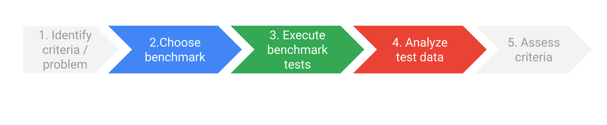
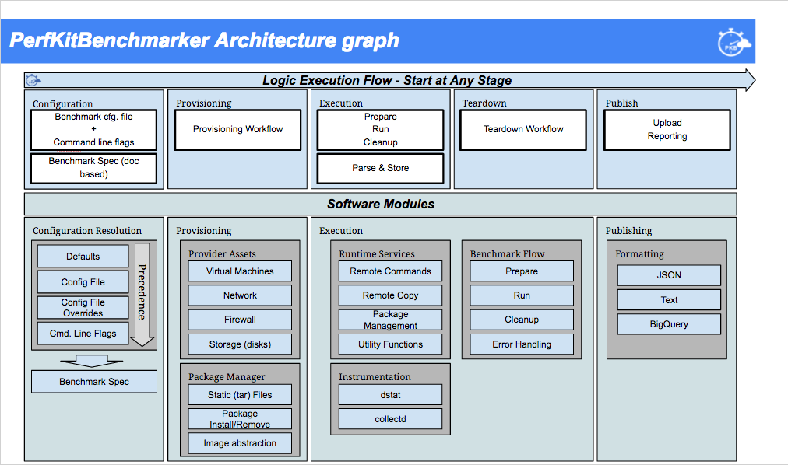
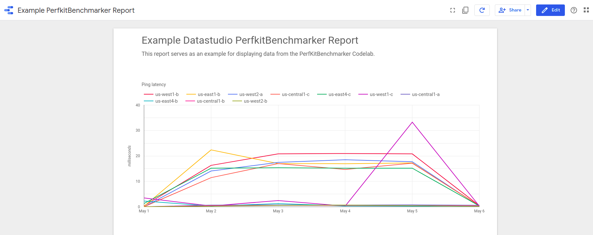
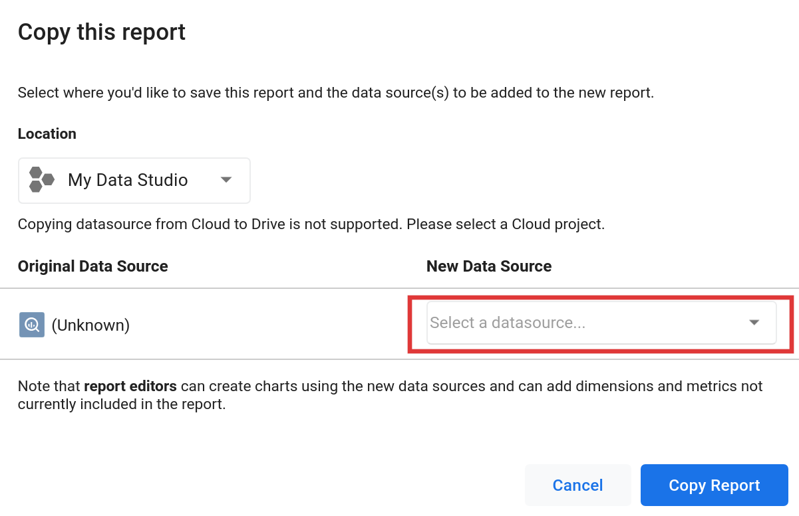
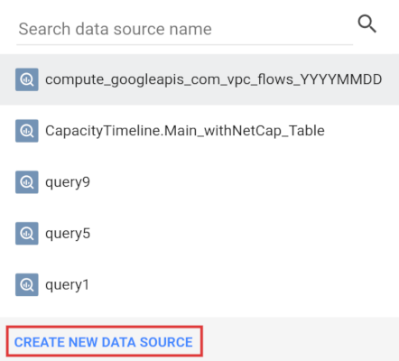
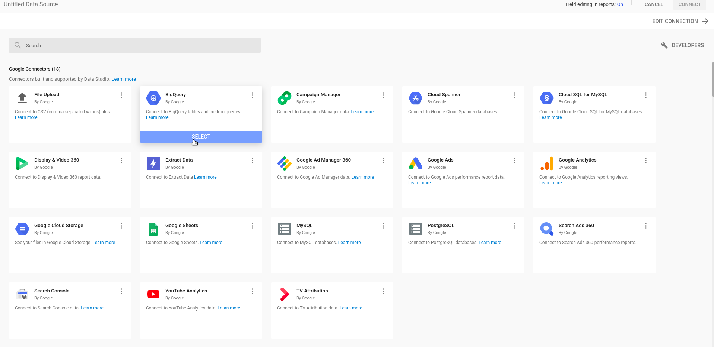
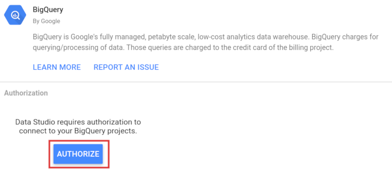
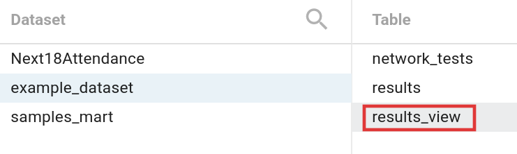
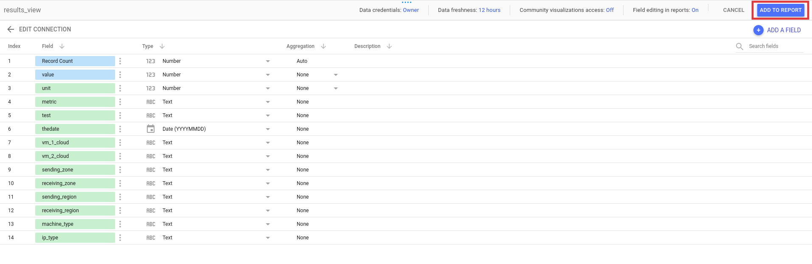
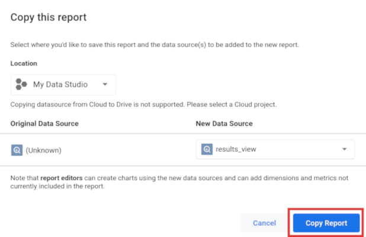

# PerfKitBenchmarker Code Lab

## Overview

### Performance benchmarking

For most users, performance benchmarking is a series of steps in pursuit of an
answer to a performance question.


### Performance benchmarking on public cloud

Challenges often arise in selecting appropriate benchmarks, configuring
nontrivial environments, achieving consistent results, and sifting through
results for actionable intelligence and reporting.

Conducting performance benchmarking in public cloud adds layers to the challenge.
Experiments need to provision resources in cloud, navigate security protections
by adjusting firewall rules, and eventually deprovision resources for cost
efficiency.

[PerfKit Benchmarker](https://github.com/GoogleCloudPlatform/PerfKitBenchmarker)
was created to aid benchmark selection, execution, and analysis using public
cloud resources.

### Introducing PerfKit Benchmarker

PerfKit Benchmarker (PKB) is an open source framework that provides a wide
selection of benchmarking tools that you can use to measure and compare
cloud providers. PKB automates setup and teardown of resources, including
Virtual Machines (VMs), on whichever cloud provider you choose, along with
installing and running the actual benchmark tests.

#### PKB Architecture

PKB divides benchmarking experiments into a multi-step process:

__Configuration > Provisioning > Execution > Teardown > Publish__



PKB is a strong starting effort at meeting most of the needs of any end-to-end
performance benchmarking project.

| PKB Arch Stage |    | Performance Benchmarking Process |
|----------------|----|----------------------------------|
| Configuration  | -> | 2. Choose benchmark              |
| Provisioning   | -> | 3. Execute benchmark tests       |
| Execution      | -> | 3. Execute benchmark tests       |
| Teardown       | -> | 3. Execute benchmark tests       |
| Publish        | -> | 4. Analyze test data             |

## What you'll do

This lab is focused on demonstrating a pattern for reducing the friction
in performance benchmarking, by using PKB.

In this lab, you will:

*   Install PerfKit Benchmarker
*   Explore PKB command-line flags
*   Consider different network benchmarks
*   Run benchmark tests using PerfKit Benchmarker
*   Understand custom configuration files and benchmark sets
*   Push test result data to [BigQuery](https://cloud.google.com/bigquery)
*   Query and visualize result data with
    [Data Studio](https://datastudio.google.com)

>> __Note:__ this lab is biased to running __networking__ benchmarks, on
>>  __Google Cloud Platform (GCP)__.
>>  Networking benchmarks are frequently an initial step in assessing
>>  the viability of public cloud environments. Ensuring understandable,
>>  repeatable, and defensible experiments is important in gaining
>>  agreement to progress to more advanced experiments, and decisions.

## Prerequisites

*   Basic familiarity with Linux command line

## Setup

### What you'll need

To complete this lab, you'll need:

*   Access to a standard internet browser (Chrome browser recommended),
    where you can access the GCP Console and the GCP Cloud Shell
*   A GCP project

### Sign in to GCP Console

In your browser, open the [GCP Console](https://console.cloud.google.com).

### Activate the Cloud Shell

From the GCP Console click the Cloud Shell icon on the top right toolbar:


Then click "Start Cloud Shell".

It should only take a few moments to provision and connect to the environment.

This virtual machine is loaded with all the development tools you'll need.
It offers a persistent 5GB home directory, and runs on the Google Cloud,
greatly enhancing network performance and authentication. Much, if not all,
of your work in this lab can be done with simply a browser or your
Google Chromebook.

Once connected to the Cloud Shell, you should see that you are already
authenticated and that the project is already set to your PROJECT_ID.

Run the following command in the Cloud Shell to confirm that you are
authenticated:

```
gcloud auth list
```

**Expected output**

```
 Credentialed accounts:
ACTIVE  ACCOUNT
*       <myaccount>@<mydomain>.com
```

**Note:** `gcloud` is the powerful and unified command-line tool for
Google Cloud Platform. Full documentation is available
from https://cloud.google.com/sdk/gcloud. It comes pre-installed on
Cloud Shell. You will notice its support for tab-completion.

In Cloud Shell, Verify your project is set up as expected.

```
gcloud config list project
```

**Expected output**

```
[core]
project = <PROJECT_ID>
```

If it is not, you can set it with this command:

```
gcloud config set project <PROJECT_ID>
```

**Expected output**

```
Updated property [core/project].
```

## Task 1. Install PerfKit Benchmarker

in this lab, you use the
[PKB repo in GitHub](https://github.com/GoogleCloudPlatform/PerfKitBenchmarker).

#### Step 1

In Cloud Shell, clone the PerfKitBenchmarker repository, and the codelab
repository side-by-side.

```
cd ~

git clone https://github.com/GoogleCloudPlatform/PerfKitBenchmarker.git
```

#### Step 2

Change to the PerfKitBenchmarker directory.

```
cd ~/PerfKitBenchmarker
```

#### Step 3

Install dependencies of PKB

```
sudo pip install -r requirements.txt
```

**Note**: As part of this exercise, you will will run a few basic tests on GCP
within a simple PKB environment. Additional setup may be required to run
benchmarks on other providers, or to run more complex benchmarks. Comprehensive
instructions for running other benchmarks can be located by reviewing the
[README in the PKB repo](https://github.com/GoogleCloudPlatform/PerfKitBenchmarker).

## Task 2. Explore PKB command-line flags

You can run benchmarks right now. Don't do this just yet, but if you execute
`./pkb.py` with no command-line flags, PKB will attempt to run a **standard**
set of benchmarks on **default** machine types in the **default** region.
Running this set takes hours.  You can read more about the **standard_set**
later in this lab.

Instead, it is more common to choose specific benchmarks and options
using **command-line flags**.

### The project, cloud provider, zones, and machine_type flags

You should understand how the `--cloud` provider, `--project`,  `--zones`,
and `--machine_type` flags work.

*   `--cloud`: As **GCP** is the default cloud provider for PKB, the
    `--cloud` flag has a default value of **GCP**.
*   `--project`: PKB needs to have a GCP **PROJECT-ID** to manage resources
    and run benchmarks. When using Cloud Shell in this lab, PKB infers the
    `--project` **PROJECT-ID** from the environment.
*   `--zone`: Every cloud provider has a default zone. For GCP, the
    `--zone` flag
    [defaults](https://github.com/GoogleCloudPlatform/PerfKitBenchmarker/blob/master/perfkitbenchmarker/configs/default_config_constants.yaml)
    to `us-central1-a`.
*   `--machine_type`: Benchmarks are frequently tightly coupled to
    specific machine capabilities, especially CPU and memory. You can pick
    your specific machines with the `--machine_type` flag. Most benchmark
    tests, including the common networking benchmarks **ping**, **iperf**,
    and **netperf**, default to the provider-specific
    `default_single_core` machine. On GCP, the
    [default machine](https://github.com/GoogleCloudPlatform/PerfKitBenchmarker/blob/master/perfkitbenchmarker/configs/default_config_constants.yaml)
    is the `n1-standard-1`.

You can learn more about alternative flag values in the
[Useful Global Flags](https://github.com/GoogleCloudPlatform/PerfKitBenchmarker#useful-global-flags)
section of the PKB readme.

### Run one benchmark test with the benchmarks flag

The `--benchmarks` flag is used to select the benchmark(s) run. Not supplying
`--benchmarks` is the same as using `--benchmarks="standard_set"`.
The **standard_set** is a collection of commonly used benchmarks. You can read
more about benchmark sets later in this lab.

Cloud benchmark tests commonly need at least 10 minutes to complete because of
the many resources, including networks, firewall rules, and VMs, that must
be both provisioned and de-provisioned.

**Start a benchmark test now, and then continue working through the lab while
the test executes.**

Run the commonly used network throughput test, **iperf**, with a small
machine, **n1-standard-1**.

**Expected duration**: ~13-14min.

```
./pkb.py --benchmarks=iperf
```

__Output (do not copy)__

```output
...
-------------------------PerfKitBenchmarker Results Summary-------------------------
IPERF:
  Throughput                         1973.000000 Mbits/sec
(ip_type="external" receiving_machine_type="n1-standard-1" ...
  Throughput                         1973.000000 Mbits/sec
(ip_type="internal" receiving_machine_type="n1-standard-1" ...
  Throughput                         1967.000000 Mbits/sec
(ip_type="external" receiving_machine_type="n1-standard-1" ...
  Throughput                         1973.000000 Mbits/sec
(ip_type="internal" receiving_machine_type="n1-standard-1" ...
...
------------------------------------------
Name   UID     Status     Failed Substatus
------------------------------------------
iperf  iperf0  SUCCEEDED
------------------------------------------
Success rate: 100.00% (1/1)
...
```

### Discovering helfpul flags and notes about benchmark tests

While **iperf** is running, explore PKB benchmarks and flags.

#### Step 1

Open a second Cloud Shell in GCP Console by clicking the **Add Cloud Shell
Session** button on top of the existing Cloud Shell.


#### Step 2

Change to the PerfKitBenchmarker directory.

```
cd ~/PerfKitBenchmarker
```

#### Step 3

PKB includes the `--helpmatch` flag which can be used to discover details
about benchmarks and related configuration flags. You can pass
`--helpmatch` a regex and it will print related help text.

Review all the global flags for PKB.

```
./pkb.py --helpmatch=pkb
```

#### Step 4

As used already, the `--benchmarks` selects a specific benchmark or
benchmark set.

Review the full list of benchmarks available.

```
./pkb.py --helpmatch=benchmarks | grep perfkitbenchmarker
```

You should see around 75 different benchmarks available to run, within the
linux_benchmarks collection.

PKB has a naming convention for benchmarks of
**[COLLECTION]_benchmarks.[NAME]_benchmark**. For example:
*   linux_benchmarks.ping_benchmark
*   linux_benchmarks.iperf_benchmark
*   linux_benchmarks.netperf_benchmark

#### Step 5

When you want to review the details and flags of a benchmark in depth, it can be
easier to read formatted MarkDown. The `--helpmatchmd` flag emits more easily
readable MarkDown text than `--helpmatch`.

Review the available Linux benchmarks using `--helpmatchmd`.

```
./pkb.py --helpmatchd=linux_benchmarks
```

You can use `more` to view the results page by page.

#### Step 6

Each benchmark can have custom flags too.

Review the flags for the **netperf** benchmark.

```
./pkb.py --helpmatchmd=netperf
```

__Output (do not copy)__

```output
### [perfkitbenchmarker.linux_benchmarks.netperf_benchmark
     ](../perfkitbenchmarker/linux_benchmarks/netperf_benchmark.py)

#### Description:

Runs plain netperf in a few modes.

docs:
http://www.netperf.org/svn/netperf2/tags/netperf-2.4.5/doc/netperf.html#TCP_005fRR
manpage: http://manpages.ubuntu.com/manpages/maverick/man1/netperf.1.html

Runs TCP_RR, TCP_CRR, and TCP_STREAM benchmarks from netperf across two
machines.


#### Flags:

`--netperf_benchmarks`: The netperf benchmark(s) to run.
    (default: 'TCP_RR,TCP_CRR,TCP_STREAM,UDP_RR')
    (a comma separated list)

`--[no]netperf_enable_histograms`: Determines whether latency histograms are
collected/reported. Only for *RR benchmarks
    (default: 'true')

`--netperf_max_iter`: Maximum number of iterations to run during confidence
interval estimation. If unset, a single iteration will be run.
    (an integer in the range [3, 30])

`--netperf_num_streams`: Number of netperf processes to run. Netperf will run
once for each value in the list.
    (default: '1')
    (A comma-separated list of integers or integer ranges. Ex: -1,3,5:7 is read
     as -1,3,5,6,7.)

`--netperf_test_length`: netperf test length, in seconds
    (default: '60')
    (a positive integer)

`--netperf_thinktime`: Time in nanoseconds to do work for each request.
    (default: '0')
    (an integer)

`--netperf_thinktime_array_size`: The size of the array to traverse for
thinktime.
    (default: '0')
    (an integer)

`--netperf_thinktime_run_length`: The number of contiguous numbers to sum at a
time in the thinktime array.
    (default: '0')
    (an integer)

### [perfkitbenchmarker.linux_packages.netperf
     ](../perfkitbenchmarker/linux_packages/netperf.py)

#### Description:

Module containing netperf installation and cleanup functions.

#### Flags:

`--netperf_histogram_buckets`: The number of buckets per bucket array in a
netperf histogram. Netperf keeps one array for latencies in the single usec
    range, one for the 10-usec range, one for the 100-usec range, and so on
until the 10-sec range. The default value that netperf uses is 100. Using
    more will increase the precision of the histogram samples that the netperf
benchmark produces.
    (default: '100')
    (an integer)
```

Review the flags for the **iperf** benchmark.

```
./pkb.py --helpmatchmd=iperf
```

__Output (do not copy)__

```output
### [perfkitbenchmarker.linux_benchmarks.iperf_benchmark
     ](../perfkitbenchmarker/linux_benchmarks/iperf_benchmark.py)

#### Description:

Runs plain Iperf.

Docs:
http://iperf.fr/

Runs Iperf to collect network throughput.


#### Flags:

`--iperf_runtime_in_seconds`: Number of seconds to run iperf.
    (default: '60')
    (a positive integer)

`--iperf_sending_thread_count`: Number of connections to make to the server for
sending traffic.
    (default: '1')
    (a positive integer)

`--iperf_timeout`: Number of seconds to wait in addition to iperf runtime before
killing iperf client command.
    (a positive integer)

### [perfkitbenchmarker.windows_packages.iperf3
     ](../perfkitbenchmarker/windows_packages/iperf3.py)

#### Description:

Module containing Iperf3 windows installation and cleanup functions.

#### Flags:

`--bandwidth_step_mb`: The amount of megabytes to increase bandwidth in each UDP
stream test.
    (default: '100')
    (an integer)

`--max_bandwidth_mb`: The maximum bandwidth, in megabytes, to test in a UDP
stream.
    (default: '500')
    (an integer)

`--min_bandwidth_mb`: The minimum bandwidth, in megabytes, to test in a UDP
stream.
    (default: '100')
    (an integer)

`--[no]run_tcp`: setting to false will disable the run of the TCP test
    (default: 'true')

`--[no]run_udp`: setting to true will enable the run of the UDP test
    (default: 'false')

`--socket_buffer_size`: The socket buffer size in megabytes. If None is
specified then the socket buffer size will not be set.
    (an integer)

`--tcp_number_of_streams`: The number of parrallel streams to run in the TCP
test.
    (default: '10')
    (an integer)

`--tcp_stream_seconds`: The amount of time to run the TCP stream test.
    (default: '3')
    (an integer)

`--udp_buffer_len`: UDP packet size in bytes.
    (default: '100')
    (an integer)

`--udp_client_threads`: Number of parallel client threads to run.
    (default: '1')
    (an integer)

`--udp_stream_seconds`: The amount of time to run the UDP stream test.
    (default: '3')
    (an integer)
```

You can see multiple flags to customize these benchmark runs.

## Task 3. Consider different network benchmarks

PerfKitBenchmarker includes 3 widely used **networking** benchmarks:
**ping**, **iperf**, and **netperf**. Each of these network tests can be useful
in different situations. Below is a short summary of each of these benchmarks.

### ping

The **ping** command is the most widely distributed and is commonly used to
verify connectivity and measure simple network latency. It measures the
round trip time (rtt) of ICMP packets.

### iperf

The **iperf** tool is easy to use and is used to measure network throughput
using TCP or UDP streams. It supports multiple threads streaming data
simultaneously. It has a variety of parameters that can be set to test and
maximize throughput.

**Note**: as of 2019, **iperf** is the name of the benchmark, but
**iperf v2** is used.

### netperf

The **netperf** tool contains several different test types. You can use
**TCP_RR**, TCP request-response, to test network latency. You can run
**TCP_STREAM** to test network throughput.

You can run multiple instances of netperf in parallel to heavily stress links
via multiple processors. The netperf tool also supports running UDP latency
and throughput tests.

With netperf, you can also see alternative reporting flavors with its data
histograms.

In many cases, it is recommended to run combinations of all three networking
benchmark tools and use the additional test result data to confirm your
findings.

## Task 4. Run benchmark tests using PerfKit Benchmarker

### Exploring the results of a benchmark

The **iperf** test you started, should now be completed. Return to the first
Cloud Shell session to review the test results from **iperf**.

Detailed output from benchmark execution is printed to the terminal, and saved
to log files under `/tmp/perfkitbenchmarker/runs/`.

Whether you scroll back in the Cloud Shell, or look through the `pkb.log` file,
you can review many details about the benchmark pass:

*   **PKB details**: version# and flags used.
*   **Resources being provisioned**: an auto-mode VPC network, two firewall
    rules, one for internal IPs and another for external IPs, two VM instances,
    and attached persistent-disks.
*   **Software setup**: Setup directories on both VMs, installations of python,
    iperf, and other packages.
*   **System configuration**: adjustments to kernel settings,
    including `tcp_congestion_control`.
*   **Test execution**: this **iperf** benchmark runs 4 different tests:
    *   VM1->VM2 throughput test over __external__ IPs
    *   VM1->VM2 throughput test over __internal__ IPs
    *   VM2->VM1 throughput test over __external__ IPs
    *   VM2->VM1 throughput test over __internal__ IPs
*   **Resources being cleaned up**: deprovision the resources created earlier.
*   **Detailed result data**:
    *   Detailed metadata describing the resources allocated.
    *   Metrics: including timestamp, units, and values for measurements.
*   **Results Summary**: an easy-to-read table with the key metrics and values.
*   **Overall test status**: especially useful when multiple benchmarks have run.

### Running more Network Benchmarks

When you have time, later, run a few more networking benchmarks. Explore the
log output, and results summaries carefully. Consider adjusting flags for the
benchmarks by looking through the `--helpmatchmd` output.

#### Measure latency with ping

Run a test to determine the latency between two machines in a single
zone.

**Expected duration**: ~11-12min.

Select the machine_type:

```
./pkb.py --benchmarks=ping --machine_type=f1-micro
```

Or, select the zone:

```
./pkb.py --benchmarks=ping --zones=us-east1-b
```

#### Measure latency and throughput with netperf

Run a test to determine the throughput and latency between two machines in a
single zone.

**Note**: as of 2019, **netperf** is the name of the benchmark, but
**netperf v2.7.0** is used with some PKB-specific patches.

**Expected duration**: ~20min.

The **netperf** benchmark takes a little longer than **iperf* *because the
binaries are compiled on the VMs, and the VMs are rebooted to apply
kernel/system configuration changes.

```
./pkb.py --benchmarks=netperf
```

__Output (do not copy)__

```output
-------------------------PerfKitBenchmarker Results Summary-------------------------
NETPERF:
...
 TCP_RR_Latency_p50                   86.000000 us                             (ip_type="internal" netperf_retransmissions="0" netserver_retransmissions="0")
  TCP_RR_Latency_p90                  177.000000 us                             (ip_type="internal" netperf_retransmissions="0" netserver_retransmissions="0")
  TCP_RR_Latency_p99                  273.000000 us                             (ip_type="internal" netperf_retransmissions="0" netserver_retransmissions="0")
  TCP_RR_Latency_min                   58.000000 us                             (ip_type="internal" netperf_retransmissions="0" netserver_retransmissions="0")
  TCP_RR_Latency_max                49808.000000 us                             (ip_type="internal" netperf_retransmissions="0" netserver_retransmissions="0")
  TCP_RR_Latency_stddev               142.160000 us                             (ip_type="internal" netperf_retransmissions="0" netserver_retransmissions="0")
...
  TCP_CRR_Latency_p50                2241.000000 us                             (ip_type="external" netperf_retransmissions="0" netserver_retransmissions="-1")
  TCP_CRR_Latency_p90                2469.000000 us                             (ip_type="external" netperf_retransmissions="0" netserver_retransmissions="-1")
  TCP_CRR_Latency_p99                2904.000000 us                             (ip_type="external" netperf_retransmissions="0" netserver_retransmissions="-1")
  TCP_CRR_Latency_min                1443.000000 us                             (ip_type="external" netperf_retransmissions="0" netserver_retransmissions="-1")
  TCP_CRR_Latency_max               54596.000000 us                             (ip_type="external" netperf_retransmissions="0" netserver_retransmissions="-1")
  TCP_CRR_Latency_stddev              750.250000 us                             (ip_type="external" netperf_retransmissions="0" netserver_retransmissions="-1")
  TCP_CRR_Transaction_Rate           3781.560000 transactions_per_second        (ip_type="internal" netperf_retransmissions="-1" netserver_retransmissions="-1")
...
  TCP_CRR_Latency_p50                 243.000000 us                             (ip_type="internal" netperf_retransmissions="-1" netserver_retransmissions="-1")
  TCP_CRR_Latency_p90                 373.000000 us                             (ip_type="internal" netperf_retransmissions="-1" netserver_retransmissions="-1")
  TCP_CRR_Latency_p99                 529.000000 us                             (ip_type="internal" netperf_retransmissions="-1" netserver_retransmissions="-1")
  TCP_CRR_Latency_min                 135.000000 us                             (ip_type="internal" netperf_retransmissions="-1" netserver_retransmissions="-1")
  TCP_CRR_Latency_max               51909.000000 us                             (ip_type="internal" netperf_retransmissions="-1" netserver_retransmissions="-1")
  TCP_CRR_Latency_stddev              220.470000 us                             (ip_type="internal" netperf_retransmissions="-1" netserver_retransmissions="-1")
  TCP_STREAM_Throughput              1956.770000 Mbits/sec                      (ip_type="external" netperf_retransmissions="6013" netserver_retransmissions="0")
  TCP_STREAM_Throughput              1965.250000 Mbits/sec                      (ip_type="internal" netperf_retransmissions="3384" netserver_retransmissions="0")
  UDP_RR_Transaction_Rate             955.900000 transactions_per_second        (ip_type="external")
...
  UDP_RR_Latency_p50                 1039.000000 us                             (ip_type="external")
  UDP_RR_Latency_p90                 1099.000000 us                             (ip_type="external")
  UDP_RR_Latency_p99                 1271.000000 us                             (ip_type="external")
  UDP_RR_Latency_min                  916.000000 us                             (ip_type="external")
  UDP_RR_Latency_max                45137.000000 us                             (ip_type="external")
  UDP_RR_Latency_stddev               399.500000 us                             (ip_type="external")
  UDP_RR_Transaction_Rate            7611.790000 transactions_per_second        (ip_type="internal")
...
  UDP_RR_Latency_p50                  112.000000 us                             (ip_type="internal")
  UDP_RR_Latency_p90                  195.000000 us                             (ip_type="internal")
  UDP_RR_Latency_p99                  286.000000 us                             (ip_type="internal")
  UDP_RR_Latency_min                   71.000000 us                             (ip_type="internal")
  UDP_RR_Latency_max                50566.000000 us                             (ip_type="internal")
  UDP_RR_Latency_stddev               163.220000 us                             (ip_type="internal")
  End to End Runtime                 1095.321094 seconds
...
----------------------------------------------
Name     UID       Status     Failed Substatus
----------------------------------------------
netperf  netperf0  SUCCEEDED
----------------------------------------------
Success rate: 100.00% (1/1)
...
```

## Task 5. Understand custom configuration files and benchmark sets

### Customizing benchmarks with custom configuration files

The easiest way to run networking benchmarks between two specific zones, with
specific flags, is to use __benchmark configuration files__.

Create a sample benchmark config file:

```
cat << EOF > ./sample_config.yml
iperf:
  vm_groups:
    vm_1:
      cloud: GCP
      vm_spec:
        GCP:
          machine_type: n1-standard-2
          zone: us-central1-b
    vm_2:
      cloud: GCP
      vm_spec:
        GCP:
          machine_type: n1-standard-2
          zone: us-east1-b
flags:
  iperf_sending_thread_count: 5
  iperf_runtime_in_seconds: 30
EOF
```

This configuration file runs __iperf__ between a VM in zone `us-central1-b` and
a VM in zone `us-east1-b`, with 5 sending threads, with 2 vCPU machines, for 30
seconds each.

You can set the cloud provider, zone, machine type, and many other options for
each VM in the config file.

When you have time later, run this benchmark by creating and using the config
file.

__Expected duration__: 10-11min.

```
./pkb.py --benchmark_config_file=./sample_config.yml --benchmarks=iperf
```

__Note__: even though the config file includes the benchmark name, you must
still supply the `--benchmarks` flag.

__Output (do not copy)__

```output
-------------------------PerfKitBenchmarker Results Summary-------------------------
...
IPERF:
  Throughput                         3606.000000 Mbits/sec
(ip_type="external" receiving_machine_type="n1-standard-2" ...
  Throughput                         3667.000000 Mbits/sec
(ip_type="internal" receiving_machine_type="n1-standard-2" ...
  Throughput                         3564.000000 Mbits/sec
(ip_type="external" receiving_machine_type="n1-standard-2" ...
  Throughput                         3700.000000 Mbits/sec
(ip_type="internal" receiving_machine_type="n1-standard-2" ...
...
------------------------------------------
Name   UID     Status     Failed Substatus
------------------------------------------
iperf  iperf0  SUCCEEDED
------------------------------------------
Success rate: 100.00% (1/1)
...
```

By default, config files must reside under the
`PerfKitBenchmarker/perfkitbenchmarker/configs/` directory.

You can also specify the full path to the config file, as instructed earlier.

```
./pkb.py --benchmark_config_file=/path/to/config/file.yml --benchmarks=iperf
```

### Understanding Benchmark Sets

PKB defines curated collections of benchmark tests called **benchmark sets**.
These sets are defined in the `perfkitbenchmarker/benchmark_sets.py`
[file](https://github.com/GoogleCloudPlatform/PerfKitBenchmarker/blob/master/perfkitbenchmarker/benchmark_sets.py).

Sets include:
*   **standard_set**: commonly agreed upon set of cloud performance benchmarks.
*   **google_set**: slightly longer collection of benchmarks than
    standard_set. Includes `tensorflow` benchmarks.
*   **kubernetes_set**: collection of tests intended to run on Kubernetes
    clusters. Requires specialized setup at this time.
*   **cloudsuite_set**: collection of cloudsuite_XXX benchmarks.

Other sets are defined as well.

You can also run multiple benchmarks by using a comma separated list with
the `--benchmarks` flag.

## Task 6. Push test result data to BigQuery

By default PKB will output results to the terminal and save logs to the
directory `/tmp/perfkitbenchmarker/runs/`.

A recommended practice is to push your result data to
[BigQuery](https://cloud.google.com/bigquery/), a serverless,
highly-scalable, cost-effective data warehouse. You can then use BigQuery to
review your test results over time, and create data visualizations.

### Populate BigQuery dataset with sample data

To quickly experiment with BigQuery, load sample test data from the
codelab repo.

#### Step 1

Initialize an empty **dataset** where result tables and views can
be created, secured and shared.

For this lab, use the BigQuery command-line tool `bq` in Cloud Shell.

Create a dataset for samples.

```
bq mk samples_mart
```

__Output (do not copy)__

```output
Dataset '[PROJECT-ID]:samples_mart' successfully created.
```

You can also create datasets using the BigQuery UI in the GCP Console.

**Note**: For this lab, use the BigQuery command-line tool `bq` in Cloud Shell.

#### Step 2

Retrieve a sample BigQuery table schema file:

```
curl -LJO https://raw.githubusercontent.com/SMU-ATT-Center-for-Virtualization/codelab_instructions/master/data/samples_mart/results_table_schema.json
```

Retrieve a sample BigQuery table data file:

```
curl -LJO https://raw.githubusercontent.com/SMU-ATT-Center-for-Virtualization/codelab_instructions/master/data/samples_mart/sample_results.json
```

> __Note:__ this data was prepared by the networking research team at the
> [AT&T Center for Virtualization](https://www.smu.edu/Provost/virtualization)
> at __Southern Methodist University__.

#### Step 3

Load the `samples_mart` dataset from a file.

```
export PROJECT=$(gcloud info --format='value(config.project)')
bq load --project_id=$PROJECT \
    --source_format=NEWLINE_DELIMITED_JSON \
    samples_mart.results \
    ./sample_results.json \
    ./results_table_schema.json
```

__Output (do not copy)__

```output
Upload complete.
Waiting on bqjob_xxxx ... (1s) Current status: DONE
```

### Query sample data in BigQuery

You can see your data using the command-line `bq` tool, again, in Cloud Shell.

```
bq query 'SELECT * FROM samples_mart.results LIMIT 200'
```

You can also see your data using the
[BigQuery UI](https://console.cloud.google.com/bigquery).

Use the __Query editor__ to __Run__ a simple query that shows your results.

```
SELECT * FROM samples_mart.results LIMIT 200;
```

### Pushing Data to BigQuery with PKB

When you're ready to run benchmarks, or sets, and push your results to BigQuery,
you need to use special command-line flags.

#### Create a dataset

Initialize an empty dataset where result tables and views can be created,
secured and shared.

Use the BigQuery command-line tool `bq` in Cloud Shell.

```
bq mk example_dataset
```

__Output (do not copy)__

```output
Dataset '[PROJECT-ID]:example_dataset' successfully created.
```

#### Run PKB with BigQuery arguments

Run PKB experiments and push the results to BigQuery.

When you run PKB, supply the BigQuery-specific arguments to send your
result data directly to BigQuery tables.

*   `--bq_project`: your GCP **PROJECT-ID** that owns the dataset and tables.
*   `--bigquery_table`: a fully qualified table name, including the dataset. The
    first time you run experiments, PKB will create the table if it does not
    yet exist.

**Expected duration**: 13-14min.

```
cd ~/PerfKitBenchmarker
export PROJECT=$(gcloud info --format='value(config.project)')
./pkb.py --benchmarks=iperf \
    --bq_project=$PROJECT \
    --bigquery_table=example_dataset.network_tests
```

__Output (do not copy)__

```output
-------------------------PerfKitBenchmarker Results Summary-------------------------
IPERF:
  receiving_machine_type="n1-standard-1" receiving_zone="us-central1-a" run_number="0" runtime_in_seconds="60" sending_machine_type="n1-standard-1" sending_thread_count="1" sending_zone="us-central1-a"
  Throughput                         1881.000000 Mbits/sec                      (ip_type="external")
  Throughput                         1970.000000 Mbits/sec                      (ip_type="internal")
  Throughput                         1970.000000 Mbits/sec                      (ip_type="external")
  Throughput                         1967.000000 Mbits/sec                      (ip_type="internal")
  End to End Runtime                  777.230134 seconds
...
------------------------------------------
Name   UID     Status     Failed Substatus
------------------------------------------
iperf  iperf0  SUCCEEDED
------------------------------------------
Success rate: 100.00% (1/1)
...
```

You can now query `example_dataset` for result data. You will learn to visualize
this data, in the next section.

## Task 7. Query and visualize result data with Data Studio

To really impact your business, though, you want to identify insights from your
performance projects. You need to look through many passes of multiple tests
over time. You may watch for unexpected spikes, variations over time, or
differences from one geography to another.

Visualization tools help you to summarize large sets of result data into
understandable charts, and tables.

__Data Studio__ is a Google tool for data visualization. It can dynamically pull
and display data from BiqQuery, and many other data sources.

With Data Studio, you can copy an existing sample __dashboard__, then customize
it to fit your requirements. You can also create dashboards from scratch.  The
BigQuery tables with your PKB results become your __data sources__.

You can attach your dashboards to your data sources to easily view your
performance data and start to identify critical insights. Data Studio maintains
a complete version history, similar to _history_ in Google Docs.

### Review a running demo instance of Data Studio

First, look at an
[Example Datastudio Report](https://datastudio.google.com/reporting/97043c2d-12ed-4d47-8b7b-4305f4b4aaed).



You will clone this report, then add your own data.

First, you need a set of performance data to use in this example.

### Load a larger set of sample data to visualize

To demonstrate the capabilities of Data Studio, load a larger collection of
demo data.

#### Step 1

If you did not already do this earlier, initialize an empty dataset
where result tables and views can be created, secured and shared.

Use the BigQuery command-line tool `bq` in Cloud Shell.

```
bq mk example_dataset
```

__Output (do not copy)__

```output
Dataset '[PROJECT-ID]:example_dataset' successfully created.
```

If you see the following error, don't worry, you already created the BigQuery
dataset.

```output
BigQuery error in mk operation: Dataset 'example_dataset' already exists
```

#### Step 2

Retrieve a sample BigQuery table data file:

```
curl -LJO https://raw.githubusercontent.com/SMU-ATT-Center-for-Virtualization/codelab_instructions/datastudio/data/bq_pkb_sample.json
```

#### Step 3

Load data to the `example_dataset` dataset from a file, to the `results` table.
The --autodetect flag is used to autodetect the table schema. The table need not
exist before running the command.

```
export PROJECT=$(gcloud info --format='value(config.project)')
bq load --project_id=$PROJECT \
    --autodetect \
    --source_format=NEWLINE_DELIMITED_JSON \
    example_dataset.results \
    ./bq_pkb_sample.json
```

__Output (do not copy)__

```output
Upload complete.
Waiting on bqjob_xxxx ... (1s) Current status: DONE
```

### Create a dataset view

Create a dataset view to make writing SQL queries against the table data easier.

#### Step 1

Create the view SQL.

```
cat << EOF > ./results_view.sql
SELECT
    value,
    unit,
    metric,
    test,
    TIMESTAMP_MICROS(CAST(timestamp * 1000000 AS int64)) AS thedate,
    REGEXP_EXTRACT(labels, r"\|vm_1_cloud:(.*?)\|") AS vm_1_cloud,
    REGEXP_EXTRACT(labels, r"\|vm_2_cloud:(.*?)\|") AS vm_2_cloud,
    REGEXP_EXTRACT(labels, r"\|sending_zone:(.*?)\|") AS sending_zone,
    REGEXP_EXTRACT(labels, r"\|receiving_zone:(.*?)\|") AS receiving_zone,
    REGEXP_EXTRACT(labels, r"\|sending_zone:(.*?-.*?)-.*?\|") AS sending_region,
    REGEXP_EXTRACT(labels, r"\|receiving_zone:(.*?-.*?)-.*?\|") AS receiving_region,
    REGEXP_EXTRACT(labels, r"\|vm_1_machine_type:(.*?)\|") AS machine_type,
    REGEXP_EXTRACT(labels, r"\|ip_type:(.*?)\|") AS ip_type
FROM
   \`$PROJECT.example_dataset.results\`
EOF
```

#### Step 2

Create a new view, with the view SQL.

```
export PROJECT=$(gcloud info --format='value(config.project)')
bq mk \
--use_legacy_sql=false \
--description '"This is my view"' \
--view "$(cat ./results_view.sql)" \
example_dataset.results_view
```

__Output (do not copy)__

```output
View '[project_id]:example_dataset.results_view' successfully created.
```

### Prepare a Data Studio Report


#### Step 1

Clone the
[Example Datastudio Report](https://datastudio.google.com/reporting/97043c2d-12ed-4d47-8b7b-4305f4b4aaed).
Load the report, and click the __Make a Copy of This Report__ button, near the top-right.


__Note:__ If you see the __Welcome to Google Data Studio__ welcome form, click __GET
STARTED__.


*   Then, acknowledge terms, and click __ACCEPT__.
*   Finally, choose __No, thanks__, and click __DONE__.

#### Step 2

Create a new Data Source. Click __Select a datasource...__



#### Step 3

Click __CREATE NEW DATA SOURCE__



#### Step 4

Click __SELECT__ on BigQuery



__Note:__ If you see the __BigQuery Authorization__ screen, click __AUTHORIZE__.



*   Click __Allow__ to authorize Data Studio to access your BigQuery data.

#### Step 5

*   Click your project under __Project__.
*   Click `example_dataset` under __Dataset__. You may need to select the
    appropriate project.
*   Click  `results_view` under __Table__.

    

#### Step 6

Click the __CONNECT__ button on the top-right, to connect the datasource.


#### Step 7

Click the `Add to Report` button on the top-right.



You have created a new data source!

#### Step 8

Then, click the __Copy Report__ button, to complete the copy.



__Note:__ You may be asked to allow Data Studio access to Drive to save your
reports. Click __Allow__.

Your report copy looks just like the example, except it uses your data from
BigQuery, through your Data Source.


#### Step 9

*   Explore the report options. Change layout, or theme options.
*   Try adding new charts, using the new data source. Data Studio offers
    different chart types and options to visualize many different metrics,
    related to performance benchmarks.

Click __View__.
Click __Edit__ to edit again.

Enjoy.

## Cleanup

Note that the following resources may have been created, that you may wish to
remove.

*   The `samples_mart` dataset in BigQuery
*   The `results` table in the `samples_mart` dataset
*   The `example_dataset` dataset in BigQuery
*   The `network_tests` table in the `example_dataset` dataset
*   Any reports you copied/created in Data Studio

## Congratulations!

You have completed the Cloud Network Benchmarking with PerfKitBenchmarker lab!

### What was covered

You installed PerfKit Benchmarker, and ran benchmark tests in the cloud.

You learned about PKB command-line flags, and a few different network
benchmarks.

You learned how to build an end-to-end workflow for running benchmarks,
gathering data, and visualizing performance trends.

### Learn More

*   Watch
    [Performance Benchmarking on Google Cloud Platform](https://youtu.be/fNMzlTmufy0)
    with tools, best practices, and methodologies from the
    PerfKitBenchmarker team.
*   Follow the
    [PKB repo](https://github.com/GoogleCloudPlatform/PerfKitBenchmarker).

### Credits

> __Note:__ the original version of this lab was prepared by the networking
> research team at the
> [AT&T Center for Virtualization](https://www.smu.edu/Provost/virtualization)
> at __Southern Methodist University__.

